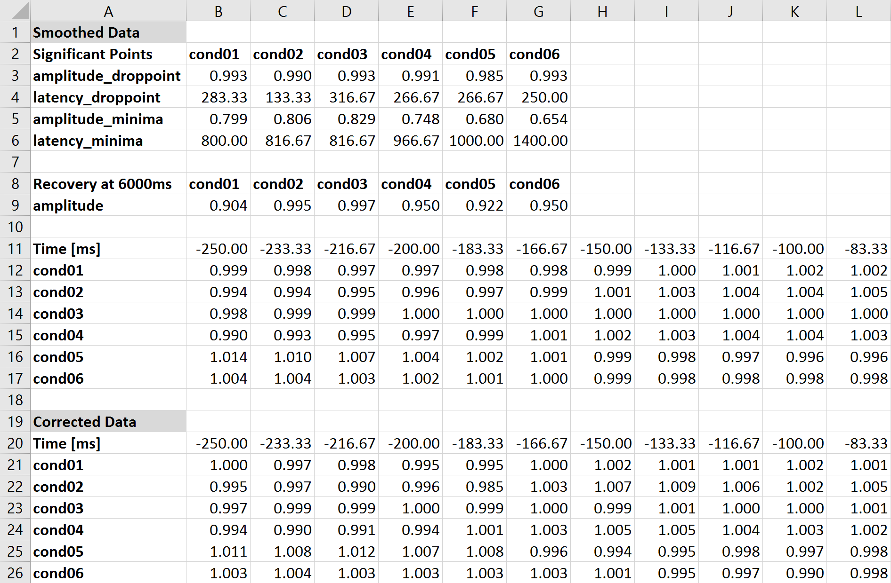

# Pupillometry Analyzer
This short script can be used to analyse pupillometry raw data saved in a wks-file. It analyzes the timeseries and creates informative figures and saves all relevant information for further analysis in xls-files.

This script runs on MATLAB or [Octave](https://www.gnu.org/software/octave/). If you use Octave, than you also need the folder `sgolay_functions` under https://github.com/miykael/pupillometryAnalyzer.

# What do you need to know to start

All the things you need to change so that the script runs according your case should be within the first 45 lines.

**First**, make sure that you set `experimentPath` to the parent folder of your experiment (Don't forget the '\' at the end of the path) and specify the path to the wks-files with `wksfilepath`.

**Second**, adapt all script relevant variables between line 18-26.

* `pupilSpeedThreshold` and `noBlinkingWindow` are needed to detect and correct for eye blinks. They work as follows: As soon as a timepoint to timepoint pupil dilation differec more than 4% (according to `pupilSpeedThreshold`), than it is seen as an eyeblink. The end of the eyeblink period is seen as the last eyeblink point after which there are no eyeblink points for 15 timepoints (according to `noBlinkingWindow`).
* The "Droppoint" of the event timecourse is divined as the point where the timecourse falls for more than 5 pre-interval duration (e.g. 250ms x 5 = 1250ms) below 2 x Standard Deviation (according `stdDropMultiplier`) of the pre-stimuli timecourse.
* `recoveryTime` specifies the timepoint from which amplitude information should be read out and saved into the output xls-file

**Third**, change the `conditions` variable according your conditions. The first string in `conditions.con1.name` specifies the filename string which defines the condition, followed by the individual names of the conditions. The `conditions.con1.step` array specifies which markers of all recorded markers should be considered as relevant.

# How does the script work

**First**, it reads the WKS-file and reads out relevant information such as pupil width and marker onset.

**Second**, it selects only relevant markers (according the step variables on [line 37](https://github.com/miykael/pupillometryAnalyzer/blob/master/read_wks.m#L37)).

**Third**, it plots an overview figure (as seen below) that shows pupil width over the whole timecourse. Highlighted in red are the relevant markers.

**Forth**, it extracts single events from the timecourse and transforms the values to percentage signal change. This is done by dividing the event by the average of the prestimuli period. Afterwards it creates a figure of this raw timecourse.

**Fifth**, it corrects for eyeblinks according the parameters `pupilSpeedThreshold` and `noBlinkingWindow`. It than creates a figure of this eyeblink corrected timecourse.

**Sixth**, it smooths the data with a Savitzky-Golay function.

**Seventh**, it calculates droppoint, minimas and recovery point and creates a figure of the smoothed timecourse, showing the location of the droppoint and minimas.

**Ninth**, it saves all the output into a mat file and an xls-file, that can be used for further analysis.

